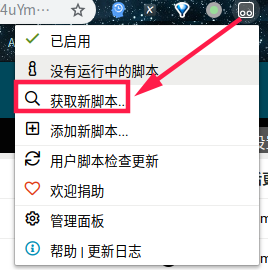

---

layout: post
title: 如何有效使用TemperMoney
keywords: tool TemperMonkey
description: 高效使用百度网盘
category: tool
tags: TemperMonkey
---

## 本文仅为记录第一次学习使用油猴过程，若有不足之处，烦请指出，谢谢……

1. 在google chrome应用商店中安装[TamperMonkey](https://chrome.google.com/webstore/detail/tampermonkey/dhdgffkkebhmkfjojejmpbldmpobfkfo?utm_source=chrome-ntp-icon),以及[UA](https://chrome.google.com/webstore/detail/user-agent-switcher-for-c/djflhoibgkdhkhhcedjiklpkjnoahfmg).
2. 点击油猴图标并获取新脚本，如下图:
<figure>

</figure>

1. 搜索安装脚本[BaiduYunEnhancer](https://openuserjs.org/scripts/maoger/BaiduYunEnhancer)
2. 修改UA，具体方式详见http://pandownload.com/faq/ua.html
3. **END**

------

其实还有一个更好用的，那就是....https://www.baiduwp.com/ 直接将链接传入到这个网站就ok啦！
